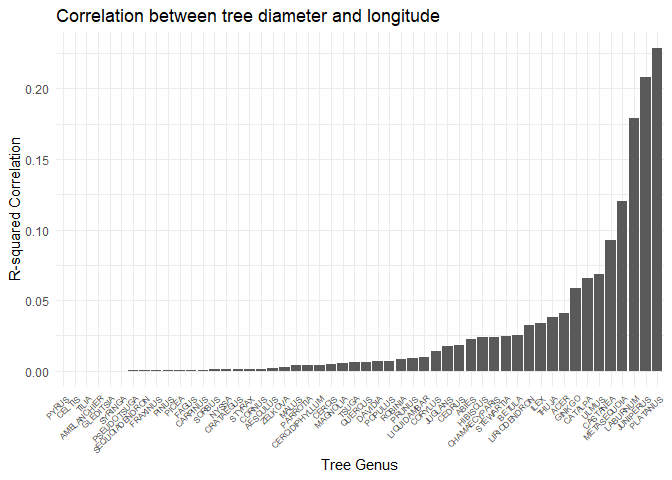

assignment-b4
================
2024-12-03

## Exercise 1

### Task: Develop a plot of the most commonly used words in the Jane Austen novel “Pride and Prejudice”

Step 1: Tidying character data

``` r
prideprejudicewords <- prideprejudice %>% 
  paste(collapse = " ") %>% # paste to string
  str_remove_all("\\d") %>% # remove numbers 
  str_remove_all("[[:punct:]]") %>% # remove punctuation
  str_squish() %>%  # remove blank spaces
  str_split("\\s+") %>% # split string into individual words
  unlist() %>% #unlisting the string
  str_to_lower() %>% # convert to lowercase
  .[!. %in% stop_words$word] # remove stop words
```

Step 2: Plotting the most common words as a wordle

``` r
word_freq <- table(prideprejudicewords) %>% # counting occurence of each word
  sort(decreasing = TRUE)
wordcloud(names(word_freq), freq = word_freq, min.freq = 50, scale = c(3, 1)) # plotting wordcloud based on frequency
```

<!-- -->

## Exercise 2

### Task: Make a function that converts words into your own version of pig latin

Step 1: Write the code to translate words to “duck latin”

``` r
#' Duck Latin Function
#'
#' Converts a word or list of words from english to duck latin
#'
#' @param .x The word or list of words to be converted
#'
#' @return The converted word or list of words
#'
#' @examples
#' word_list <- c("red", "orange", "yellow")
#' duck_latin(word_list)


duck_latin <- function(.x) {
  consonants <- c("b", "c", "d", "f", "g", "h", "j", "k", "l", "m", "n", "p", "q", "r", "s", "t", "v", "w", "x", "y", "z")
  
  # Function to check if a character is a consonant
  is_consonant <- function(char) {
    return(str_to_lower(char) %in% consonants)
  }
  
  # Function to check for the presence and length of a consonant cluster at the front
  starts_with_consonant_cluster <- function(.x) {
    cluster_end <- 1
    while (cluster_end <= str_length(.x) && is_consonant(str_sub(.x, cluster_end, cluster_end))) {
      cluster_end <- cluster_end + 1
    }
    return(cluster_end - 1)
  }
  
  # If the word starts with a consonant cluster, move the consonant cluster to the end and append "ak"
  consonant_cluster_len <- starts_with_consonant_cluster(.x)
  if (is.numeric(.x)){
    return("The input is numeric and cannot be translated to duck latin")
  }
  if (consonant_cluster_len > 0) {
    consonant_cluster <- str_sub(.x, 1, consonant_cluster_len)
    remaining_word <- str_sub(.x, consonant_cluster_len + 1, str_length(.x))
    return(str_c(remaining_word, consonant_cluster, "ak"))
  } else {
    # If the word starts with a vowel cluster, leave the word structure and append "ak" to the end
    return(str_c(.x, "ak"))
  }
}
```

Step 2: Example of using the function

``` r
dictionary <- c("alpha", "bravo", "charlie", "delta", "echo") # Set the list of words to translate
print(map_chr(dictionary, duck_latin))
```

    ## [1] "alphaak"   "avobrak"   "arliechak" "eltadak"   "echoak"

Step 3: Perform 3 non-redundant tests

``` r
# Test one: print direct return output
print(c("Test 1:", duck_latin("sleep")))
```

    ## [1] "Test 1:" "eepslak"

``` r
#Test two: print list return output of each letter combination type
list <- c("oolong", "flame", "apple", "party") # vowel-vowel, consonant-consonant, vowel-consonant, and consonant-vowel
print(c("Test 2:", map_chr(list, duck_latin)))
```

    ## [1] "Test 2:"  "oolongak" "ameflak"  "appleak"  "artypak"

``` r
#Test three: input numbers to check for error
print(c("Test 3:", duck_latin(1)))
```

    ## [1] "Test 3:"                                                    
    ## [2] "The input is numeric and cannot be translated to duck latin"

## Exercise 3

### Task: Evaluate a model that is fit seperately for each group in some dataset

Step 1: Make a column of model objects

``` r
common_trees <- vancouver_trees %>%
  select(tree_id, genus_name, diameter, height_range_id, longitude) %>% #selecting columns that will be used
  filter(!is.na(longitude)) %>% 
  group_by(genus_name) %>% #grouping by genus for count
  mutate(genus_count = n()) %>% #counting the number of trees in each genus
  filter(genus_count >= 50) %>%  #removing any trees with a genus count less than 50
  nest() %>%  #nesting initial data
  mutate(model = map(data, ~ lm(diameter ~ longitude, data = .))) #mapping linear regression model of diameter and longitude
```

Step 2: Evaluate the models for R-squared, coefficient, residual, and
fitted values and print the intermediate tibble

``` r
model_evaluation <- common_trees %>%
  mutate(r_squared = map(model, ~ summary(.x)$r.squared), #adding r-squared column
    coefficient = map(model, ~ coef(.x)[1]), #adding coefficient column
    residual = map(model, ~ residuals(.x)), #adding residual column
    fitted_value = map(model, ~ fitted(.x))) #adding fitted value column
```

Step 3: Print the nested intermediate tibble

``` r
model_evaluation
```

    ## # A tibble: 52 × 7
    ## # Groups:   genus_name [52]
    ##    genus_name  data     model  r_squared coefficient residual       fitted_value
    ##    <chr>       <list>   <list> <list>    <list>      <list>         <list>      
    ##  1 ULMUS       <tibble> <lm>   <dbl [1]> <dbl [1]>   <dbl [2,630]>  <dbl>       
    ##  2 ZELKOVA     <tibble> <lm>   <dbl [1]> <dbl [1]>   <dbl [309]>    <dbl [309]> 
    ##  3 STYRAX      <tibble> <lm>   <dbl [1]> <dbl [1]>   <dbl [1,141]>  <dbl>       
    ##  4 FRAXINUS    <tibble> <lm>   <dbl [1]> <dbl [1]>   <dbl [6,531]>  <dbl>       
    ##  5 ACER        <tibble> <lm>   <dbl [1]> <dbl [1]>   <dbl [30,536]> <dbl>       
    ##  6 PYRUS       <tibble> <lm>   <dbl [1]> <dbl [1]>   <dbl [1,789]>  <dbl>       
    ##  7 TILIA       <tibble> <lm>   <dbl [1]> <dbl [1]>   <dbl [5,919]>  <dbl>       
    ##  8 HIBISCUS    <tibble> <lm>   <dbl [1]> <dbl [1]>   <dbl [168]>    <dbl [168]> 
    ##  9 LIQUIDAMBAR <tibble> <lm>   <dbl [1]> <dbl [1]>   <dbl [1,447]>  <dbl>       
    ## 10 PRUNUS      <tibble> <lm>   <dbl [1]> <dbl [1]>   <dbl [27,187]> <dbl>       
    ## # ℹ 42 more rows

Step 4: Unnest the calculations and print the final tibble

``` r
final_tbl <- model_evaluation %>% 
  unnest(cols = c(data, r_squared, coefficient, residual, fitted_value)) %>% #unnesting columns
  arrange(r_squared) %>%  #sorting in order of ascended r-squared
  select(genus_name, r_squared, coefficient, residual, fitted_value)


glimpse(final_tbl)
```

    ## Rows: 123,340
    ## Columns: 5
    ## Groups: genus_name [52]
    ## $ genus_name   <chr> "PYRUS", "PYRUS", "PYRUS", "PYRUS", "PYRUS", "PYRUS", "PY…
    ## $ r_squared    <dbl> 3.18645e-08, 3.18645e-08, 3.18645e-08, 3.18645e-08, 3.186…
    ## $ coefficient  <dbl> 5.867635, 5.867635, 5.867635, 5.867635, 5.867635, 5.86763…
    ## $ residual     <dbl> 0.3550941, 2.8560246, 0.3549942, -0.6450058, 0.3549942, 2…
    ## $ fitted_value <dbl> 4.644906, 4.643975, 4.645006, 4.645006, 4.645006, 4.64541…

Step 5: Produce a plot of the results

``` r
plot_data <- final_tbl %>%
  group_by(genus_name) %>%
  summarise(avg_r_squared = mean(r_squared, na.rm = TRUE)) %>%
  mutate(genus_name = reorder(genus_name, avg_r_squared, FUN = max))

ggplot(plot_data, aes(x = genus_name, y = avg_r_squared)) +
  geom_bar(stat = "identity") +
  theme_minimal() +
  labs(title = "Most Common Trees in the City of Vancouver", subtitle = "Correlation between tree diameter and longitude", x = "Tree Genus", y = "R-squared Correlation") +
  theme(axis.text.x = element_text(angle = 45, hjust = 1, size = 6))
```

<!-- -->
Explaining this analysis:

In this analysis, we show that certain genus of trees are more likely to
show a correlation between their diameter and longitude than others. To
do so, we take our initial dataset of all of the trees in Vancouver. We
then filter and select tree genus groups with at least 50 trees. This is
important, because for groups of less than 50, the statistics
calculation we do next may be skewed by the small group size.

Next, we run a linear regression model to determine the correlation
between tree diameter and longitude. At this point, the individual tree
data is nested, so r-squared values are for the whole genus while
coefficients, residuals, and fitted values are stored as lists under
each genus. To clairfy this, we unnest the data and print a glimpse of
the table which shows the stats calculations for each individual tree in
our dataset.

Finally, we produce a barchart plot which shows the r-squared value for
each tree genus. We can see the tree genus platanus has the closest
correlation between diameter and longitude. With an R-squared value of
approximately 0.23, this is not a very strong correlation, but it does
exhibit a weak link between tree size and east-west location within the
city.
